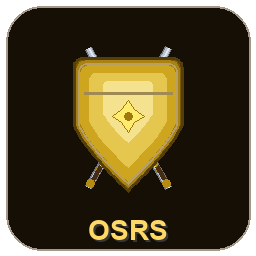

<p align="center">
  
</p>

<h1 align="center">OSRS Companion</h1>

<p align="center">
  A free, open-source <strong>Old School RuneScape</strong> desktop companion app built with Flutter.<br/>
  Track your account, plan your goals, optimise your gear, and make the most of every play session.
</p>

---

## Table of Contents

1. [Features](#features)
2. [Screenshots](#screenshots)
3. [Download & Install](#download--install)
4. [First-Time Setup](#first-time-setup)
5. [Feature Guide](#feature-guide)
6. [Building from Source](#building-from-source)
7. [Project Structure](#project-structure)
8. [Environment Configuration](#environment-configuration)
9. [Contributing](#contributing)
10. [License](#license)

---

## Features

| Category     | Feature              | Description                                                                   |
| ------------ | -------------------- | ----------------------------------------------------------------------------- |
| **Account**  | Characters           | Add your RSN, look up Hiscores, track multiple accounts (main, ironman, etc.) |
|              | Command Center       | Central hub for quick actions and account overview                            |
|              | Vault                | Encrypted password/pin storage for your accounts                              |
| **Tracking** | Goals                | Set and track XP / level / item goals with progress bars                      |
|              | Sessions             | Log play sessions with XP gained, GP earned, and notes                        |
|              | Notes                | Freeform notes organised by category                                          |
|              | Bingo                | OSRS bingo card tracker for group events                                      |
| **Planning** | Goal Planner         | AI-powered micro-goal engine that breaks big goals into achievable steps      |
|              | Boss Progression     | Track boss kill counts and unlock progression                                 |
|              | Time Budget Planner  | Tell the app how long you want to play and get a session plan                 |
|              | Cookbook             | Herblore, Cooking, and crafting recipe reference                              |
| **Tools**    | Best-in-Slot Gear    | Browse BiS equipment for every combat style, filtered by your bank            |
|              | Slayer Task Helper   | Recommended gear for every slayer monster with strategy notes                 |
|              | Gear Loadout Presets | Save, import, and export gear loadouts (RuneLite Bank Tag format)             |
|              | Player Tracker       | Look up and compare any player's Hiscores                                     |
|              | GE Prices            | Real-time Grand Exchange price lookup                                         |
|              | Skill Calculator     | Calculate XP needed, actions, and time for any skill 1-99                     |
|              | Superglass Make Calc | Dedicated calculator for superglass make spell                                |
|              | Dry Calculator       | Calculate drop rate probability and how unlucky you are                       |
|              | Daily Tasks          | Track daily/weekly activities (battlestaves, herb runs, etc.)                 |
|              | Wiki Search          | Search the OSRS Wiki directly from the app                                    |
| **System**   | Auto-Updates         | Checks GitHub Releases for new versions on startup                            |
|              | Multi-Environment    | Separate DEV / QA / PROD builds with isolated data                            |

---

## Download & Install

### Option A — Pre-built Release (Recommended)

1. Go to the [**Releases**](https://github.com/bossLarit/runescape_companion/releases) page.
2. Download the latest `.zip` file for your platform (currently **Windows**).
3. Extract the zip to a folder of your choice (e.g. `C:\Games\OSRS Companion`).
4. Run **`runescape_companion.exe`**.
5. That's it! The app will check for updates automatically on each launch.

> **Windows SmartScreen:** You may see a "Windows protected your PC" warning the first time. Click **More info** → **Run anyway**. This happens because the app is not code-signed.

### Option B — Build from Source

See [Building from Source](#building-from-source) below.

---

## First-Time Setup

When you launch OSRS Companion for the first time, you'll go through a quick onboarding flow:

### Step 1 — Add Your Character

1. Click **"Add Character"** on the onboarding screen.
2. Enter your **RuneScape Name (RSN)** exactly as it appears in-game.
3. Select your **account type**: Normal, Ironman, Hardcore Ironman, Ultimate Ironman, or Group Ironman.
4. Click **Save**. The app will automatically look up your Hiscores.

You can add multiple characters later from the **Characters** page.

### Step 2 — Import Your Bank (Optional but Recommended)

Your bank items power several features: Best-in-Slot filtering, auto-generated gear loadouts, and the skill calculator.

1. Navigate to **Best Setup** → **BiS Gear** tab.
2. Click the **"My Items"** toggle in the header.
3. Click **"Manage Bank"** to open the bank editor.
4. You can:
   - **Type item names** manually, one per line
   - **Paste a list** from a RuneLite bank export
   - **Import from file** (text file with item names)

### Step 3 — Explore!

Use the **sidebar** to navigate between features. The **Dashboard** gives you a quick overview of your active character's stats and recent activity.

---

## Feature Guide

### Best-in-Slot Gear

Navigate to **Best Setup** in the sidebar. Three tabs are available:

- **BiS Gear** — Browse best-in-slot equipment for Melee, Ranged, and Magic. Toggle "My Items" to filter by items you actually own.
- **Slayer Task** — Select any slayer monster to see recommended gear per slot, strategy notes, and notable drops. Covers 40+ monsters including Custodian stalkers, Abyssal demons, Cerberus, and more.
- **Loadouts** — Create, edit, and manage gear loadout presets.

### Gear Loadout Presets

Create gear presets for any activity:

1. Go to **Best Setup** → **Loadouts** tab.
2. Click **+** to create a new loadout manually, or:
   - Click the **magic wand** icon to **auto-generate slayer loadouts** from your bank (creates Melee/Ranged/Magic loadouts for every slayer monster).
   - Click the **download** icon to **import a RuneLite Bank Tag Layout** string.

**Importing from RuneLite:**

1. In RuneLite, go to your Bank Tag Layout plugin.
2. Click **Export** to copy the layout string to clipboard.
3. In OSRS Companion, click the download icon → paste the string → click **Import**.
4. The app fetches item names from the OSRS Wiki API and creates the loadout.

The import format is: `banktaglayoutsplugin:<name>,<itemId>:<position>,...`

### Skill Calculator

Navigate to **Skill Calculator** in the sidebar.

1. Select a **skill** from the dropdown.
2. Set your **current level** — auto-fills from Hiscores if a character is active.
3. Set your **target level** (defaults to 99, type any level you want).
4. The calculator shows:
   - **XP needed** between your current and target levels
   - **Every training method** with XP/action, actions needed, XP/hr, and estimated time
   - **Milestones** for the skill on the right panel
   - A **progress bar** showing your XP journey

Use the **search bar** and **category chips** (e.g. Course, Minigame) to filter methods.

There's also a dedicated **Superglass Make** calculator for Crafting/Magic training.

### Time Budget Planner

1. Go to **Time Budget** in the sidebar.
2. Set **how long** you want to play (15 minutes to 4 hours).
3. Choose your **intensity** (AFK, Mix, Active).
4. Choose your **focus** (Balanced, Max XP, Quick Wins).
5. Click **Generate Session Plan** to get a tailored activity plan.

> Requires an active character with Hiscores data.

### Goal Planner

The AI-powered goal planner breaks long-term goals into bite-sized steps:

1. Go to **Goal Planner** in the sidebar.
2. Your character's stats are analyzed to suggest optimal training paths.
3. Each micro-goal shows the skill, level range, best method, XP needed, and estimated time.

### Player Tracker

Look up any player's stats:

1. Go to **Player Tracker** in the sidebar.
2. Type a **RuneScape Name** and search.
3. View their full Hiscores breakdown.

### GE Prices

1. Go to **GE Prices** in the sidebar.
2. Search for any item to see its current Grand Exchange price.
3. Uses the official OSRS GE API for real-time data.

### Dry Calculator

Calculate how (un)lucky you are:

1. Go to **Dry Calculator** in the sidebar.
2. Enter the **drop rate** (e.g. 1/512).
3. Enter the **number of kills**.
4. See the probability of getting (or not getting) the drop.

### Daily Tasks

Track recurring activities:

1. Go to **Daily Tasks** in the sidebar.
2. Check off tasks as you complete them (battlestaves, herb runs, birdhouse runs, etc.).
3. Tasks reset on their respective daily/weekly timers.

### Vault (Password Storage)

Store account credentials securely:

1. Go to **Vault** in the sidebar.
2. Entries are encrypted and stored locally.
3. Only accessible on your machine.

---

## Building from Source

### Prerequisites

- **Flutter SDK** 3.0+ — [Install Flutter](https://docs.flutter.dev/get-started/install)
- **Windows:** Visual Studio 2022 with C++ desktop development workload
- **Git**

### Steps

```bash
# 1. Clone the repository
git clone https://github.com/bossLarit/runescape_companion.git
cd runescape_companion

# 2. Install dependencies
flutter pub get

# 3. Run in debug mode
flutter run -d windows

# 4. Build a release
flutter build windows --release
```

The release build output is in `build/windows/x64/runner/Release/`.

### Running Different Environments

```bash
# Development (isolated data, debug banner, pre-release updates)
flutter run -d windows -t lib/main_dev.dart

# QA (isolated data, debug banner, pre-release updates)
flutter run -d windows -t lib/main_qa.dart

# Production (default)
flutter run -d windows -t lib/main.dart
```

---

## Project Structure

```
lib/
  app/
    app.dart              # App widget with theme and providers
    router.dart           # GoRouter navigation with sidebar shell
    theme.dart            # OSRS-themed dark Material theme
  core/
    config/
      environment.dart    # DEV / QA / PROD environment configs
    constants/
      app_constants.dart  # App-wide constants and file names
    services/
      local_storage_service.dart   # JSON persistence to local disk
      osrs_api_service.dart        # Hiscores API client
      update_service.dart          # GitHub Releases auto-updater
      item_mapping_service.dart    # OSRS item ID ↔ name mapping
    widgets/
      app_shell.dart      # Sidebar navigation shell
  features/
    best_setup/           # BiS gear, slayer tasks, gear loadouts
    bingo/                # Bingo card tracker
    boss_progression/     # Boss kill count tracking
    characters/           # RSN management and Hiscores
    command_center/       # Quick actions hub
    cookbook/              # Recipe reference
    daily_tasks/          # Daily/weekly task checklist
    dashboard/            # Home screen overview
    dry_calc/             # Drop rate probability calculator
    ge_prices/            # Grand Exchange price lookup
    goal_planner/         # AI micro-goal engine
    goals/                # Manual goal tracking
    notes/                # Freeform notes
    onboarding/           # First-time setup flow
    password_vault/       # Encrypted credential storage
    player_tracker/       # Hiscores lookup for any player
    sessions/             # Play session logger
    settings/             # App settings
    skill_calc/           # Skill XP/action calculator
    time_budget/          # Session time planner
    wiki_search/          # OSRS Wiki search
  main.dart               # Production entry point
  main_dev.dart           # Development entry point
  main_qa.dart            # QA entry point
```

---

## Environment Configuration

The app supports three environments with isolated storage and update channels:

| Environment | Entry Point         | App Name             | Data Folder           | Update Channel |
| ----------- | ------------------- | -------------------- | --------------------- | -------------- |
| **DEV**     | `lib/main_dev.dart` | OSRS Companion [DEV] | `osrs_companion_dev/` | Pre-release    |
| **QA**      | `lib/main_qa.dart`  | OSRS Companion [QA]  | `osrs_companion_qa/`  | Pre-release    |
| **PROD**    | `lib/main.dart`     | OSRS Companion       | `osrs_companion/`     | Latest stable  |

DEV and QA builds show an environment badge in the app footer.

---

## CI/CD

GitHub Actions workflows are configured for each environment:

- **`dev.yml`** — Runs on push/PR to `dev` branch. Builds and tests.
- **`qa.yml`** — Runs on push to `qa` or `v*-rc*` tags. Creates pre-release.
- **`release.yml`** — Runs on `v*.*.*` tags to `main`. Creates production release.

---

## Tech Stack

- **Framework:** [Flutter](https://flutter.dev/) 3.x (Desktop — Windows, macOS, Linux)
- **State Management:** [Riverpod](https://riverpod.dev/) + [Flutter Hooks](https://pub.dev/packages/flutter_hooks)
- **Routing:** [GoRouter](https://pub.dev/packages/go_router)
- **APIs:** OSRS Hiscores, Grand Exchange, OSRS Wiki real-time prices
- **Storage:** Local JSON files via `path_provider`
- **Updates:** GitHub Releases API

---

## Contributing

1. Fork the repo and create a feature branch from `dev`.
2. Make your changes and run `flutter analyze` to check for issues.
3. Submit a pull request to `dev`.

---

## License

This project is not affiliated with or endorsed by Jagex Ltd. Old School RuneScape is a registered trademark of Jagex Ltd.
